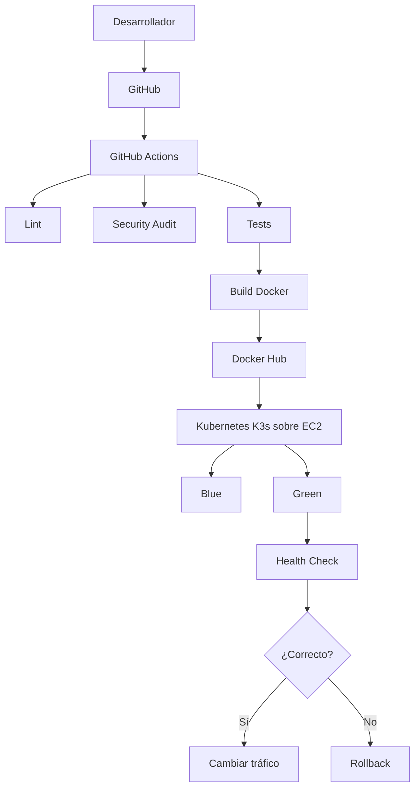
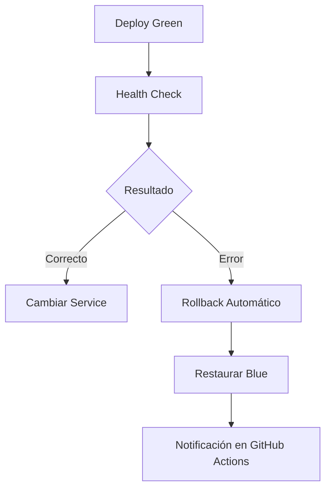

# Evaluación Final Transversal - AUY1104

# Operación Resiliencia en TechMarket

## Tabla de Contenidos

- Descripción
- Objetivos
- Arquitectura de la Solución
- Estructura del Proyecto
- Función de los Archivos Principales
- Herramientas Utilizadas
- Plantillas Reutilizables
- Pipeline CI
- Variables de Entorno Dinámicas
- Pipeline CD
- Estrategia de Despliegue
- Comparación entre Estrategias
- Justificación de Blue-Green
- Mecanismo de Remediación Automática
- Escenarios de Error
- Beneficios para el Negocio
- Conclusión
- Referencias
- Integrante

---

# Descripción

Este repositorio corresponde a la Evaluación Final Transversal (EFT) de la asignatura **Ciclo de Vida del Software II (AUY1104)**.

El proyecto implementa un proceso completo de **Integración Continua (CI)** y **Despliegue Continuo (CD)** utilizando GitHub Actions, Docker Hub y Kubernetes, incorporando una estrategia **Blue-Green Deployment** junto con mecanismos de recuperación automática (**Rollback**) para garantizar la continuidad operacional del servicio.

> Para esta evaluación se utiliza la infraestructura desarrollada durante el semestre. De acuerdo con la indicación del docente, el rol de Amazon EKS fue implementado utilizando **K3s sobre una instancia EC2**, mientras que el rol de Amazon ECR fue reemplazado por **Docker Hub**, manteniendo la misma lógica de automatización y despliegue.

---

# Objetivos

## Objetivo General

Implementar un pipeline CI/CD reutilizable que automatice la construcción, validación y despliegue del microservicio utilizando GitHub Actions y Kubernetes.

## Objetivos Específicos

- Automatizar la construcción de imágenes Docker.
- Publicar automáticamente imágenes en Docker Hub.
- Reutilizar workflows mediante GitHub Actions.
- Implementar una estrategia Blue-Green Deployment.
- Automatizar la recuperación mediante Rollback.
- Reducir el riesgo de indisponibilidad durante los despliegues.

---

# Arquitectura de la Solución



---

# Estructura del Proyecto

```text
SharedClient/
├── .github/workflows
├── k8s
├── Dockerfile
└── package.json

SharedWorkflows/
└── .github/workflows
```

---

# Función de los Archivos Principales

| Archivo | Función |
|----------|----------|
| client.yaml | Ejecuta el pipeline principal |
| deploy-api.yaml | Build y Push hacia Docker Hub |
| deploy-k8s-api.yaml | Despliegue de manifiestos Kubernetes |
| cd-pipeline.yaml | Blue-Green Deployment y Rollback |
| hotfix.yml | Despliegue Hotfix |
| test.yml | Lint, Auditoría y Tests |
| blue-green.yaml | Estrategia Blue-Green |
| canary.yaml | Estrategia Canary |
| rolling-update.yaml | Estrategia Rolling Update |

---

# Herramientas Utilizadas

| Herramienta | Función |
|-------------|----------|
| Git | Control de versiones |
| GitHub | Repositorio |
| GitHub Actions | Automatización CI/CD |
| Docker | Contenedores |
| Docker Hub | Registro de imágenes |
| Kubernetes (K3s) | Orquestación |
| Node.js | Aplicación |

---

# Plantillas Reutilizables

Con el propósito de cumplir el **Ítem 1** de la Evaluación Final Transversal, el pipeline fue refactorizado para utilizar **GitHub Actions** mediante **workflows reutilizables** (`workflow_call`).

Esta estrategia permite desacoplar la lógica del pipeline, evitar duplicación de código y facilitar el mantenimiento.

Las principales plantillas implementadas son:

- **deploy-api.yaml:** Construcción de la imagen Docker y publicación automática en Docker Hub.
- **deploy-k8s-api.yaml:** Despliegue automático de manifiestos Kubernetes.
- **client.yaml:** Invoca los workflows reutilizables mediante `uses`.
- **cd-pipeline.yaml:** Implementa Blue-Green Deployment, Validación de Salud y Rollback Automático.

La reutilización se logra mediante **inputs**, **GitHub Secrets** y variables dinámicas, permitiendo utilizar la misma plantilla para distintos proyectos sin modificar el código fuente.

---

# Pipeline CI

El proceso de Integración Continua fue completamente migrado a **GitHub Actions**.

El pipeline ejecuta automáticamente:

1. Checkout del repositorio.
2. Instalación de dependencias.
3. ESLint.
4. Auditoría de seguridad (`npm audit`).
5. Ejecución de pruebas automáticas.
6. Construcción de la imagen Docker.
7. Publicación automática de la imagen en Docker Hub.

La construcción y publicación se realizan utilizando un **workflow reutilizable**, cumpliendo con el proceso solicitado para la automatización del Build.

---

# Variables de Entorno Dinámicas

Con el objetivo de reutilizar los pipelines sin modificar el código fuente, la solución utiliza información sensible almacenada mediante **GitHub Secrets**.

Entre ellas destacan:

- image-name
- image-tag
- DOCKER_USERNAME
- DOCKER_PASSWORD
- AWS_ACCESS_KEY_ID
- AWS_SECRET_ACCESS_KEY
- AWS_SESSION_TOKEN
- KUBECONFIG_K3S

Los workflows reutilizables reciben parámetros mediante **inputs** (`image-name`, `image-tag`) y credenciales mediante **GitHub Secrets**, evitando modificar los archivos YAML al cambiar de versión o entorno.

Gracias a esta parametrización, el mismo pipeline puede desplegar distintas versiones del microservicio reutilizando exactamente la misma lógica.

---

# Pipeline CD

El pipeline de Despliegue Continuo ejecuta automáticamente:

1. Checkout.
2. Configuración del clúster Kubernetes.
3. Despliegue Blue-Green.
4. Validación de Salud.
5. Cambio automático del tráfico.
6. Rollback automático en caso de falla.

---

# Estrategia de Despliegue

Se seleccionó **Blue-Green Deployment** debido a que permite mantener dos versiones del servicio ejecutándose simultáneamente.

La nueva versión (**Green**) es validada antes de recibir tráfico.

Una vez superadas las validaciones, el Service cambia automáticamente el tráfico hacia Green.

Si alguna validación falla, el Service permanece apuntando a Blue o ejecuta automáticamente el rollback.

---

# Comparación entre Estrategias

| Estrategia | Uptime | Costo | Velocidad | Rollback |
|------------|--------|--------|------------|-----------|
| All-in-Once | Bajo | Bajo | Muy alta | Difícil |
| Rolling Update | Alto | Bajo | Alta | Medio |
| Canary | Muy alto | Alto | Media | Muy rápido |
| Blue-Green | Muy alto | Alto | Alta | Inmediato |

---

# Justificación de Blue-Green

Blue-Green fue seleccionada debido a que ofrece la mayor disponibilidad para un servicio crítico como **TechMarket Orders**, permitiendo desplegar una nueva versión sin interrumpir la operación.

La estrategia mantiene simultáneamente una versión estable (Blue) y una nueva versión (Green). Antes de redirigir el tráfico, la versión Green es validada mediante un Health Check.

Si la validación es exitosa, el Service cambia automáticamente hacia Green.

En caso contrario, el sistema mantiene el tráfico en Blue o ejecuta el rollback automático.

Esta estrategia reduce el riesgo de indisponibilidad, disminuye el tiempo medio de recuperación (MTTR) y permite liberar nuevas versiones con mayor seguridad.

---

# Mecanismo de Remediación Automática



El pipeline incorpora lógica condicional mediante `if: failure()` para ejecutar automáticamente el rollback cuando la validación de salud falla.

Durante las pruebas del proyecto se simuló una falla controlada en la etapa de validación para comprobar este comportamiento. Al detectarse el error, el pipeline evitó el cambio de tráfico hacia Green y restauró automáticamente la versión Blue, garantizando la continuidad operacional del servicio.

---

# Escenarios de Error

Durante el desarrollo fueron considerados escenarios reales de Kubernetes como:

- CrashLoopBackOff.
- ImagePullBackOff.
- Readiness Probe fallida.
- Liveness Probe fallida.
- Error HTTP 500.
- Imagen inexistente.
- Error de configuración del Deployment.

---

# Beneficios para el Negocio

La arquitectura implementada entrega beneficios directos para TechMarket:

- Reduce los tiempos de despliegue.
- Disminuye errores manuales mediante automatización.
- Aumenta la disponibilidad del servicio.
- Reduce el MTTR gracias al rollback automático.
- Permite liberar nuevas versiones con menor riesgo.
- Facilita la reutilización de pipelines mediante workflows compartidos.

Gracias a esta solución, el microservicio **TechMarket Orders** puede desplegar nuevas versiones de forma segura, manteniendo la continuidad operacional y reduciendo el impacto de posibles fallas durante la liberación en producción.

---

# Conclusión

La solución implementa una arquitectura DevOps moderna basada en GitHub Actions, Docker Hub y Kubernetes (K3s sobre EC2), utilizando workflows reutilizables para automatizar la construcción, validación y despliegue del microservicio.

La incorporación de la estrategia **Blue-Green Deployment**, junto con la Validación de Salud y el Rollback Automático, permite reducir riesgos durante la liberación de nuevas versiones, aumentar la disponibilidad del servicio y mejorar la continuidad operacional de **TechMarket Orders**, cumpliendo los objetivos establecidos para la Evaluación Final Transversal.

---

# Referencias

- GitHub Actions Documentation
- Docker Documentation
- Docker Hub Documentation
- Kubernetes Documentation
- Node.js Documentation

---

# Integrante

**Valentina Paz Astudillo Martínez**

---

**Asignatura:** Ciclo de Vida del Software II (AUY1104)

**Evaluación:** Evaluación Final Transversal (EFT)

**Institución:** Duoc UC - Sede Antonio Varas