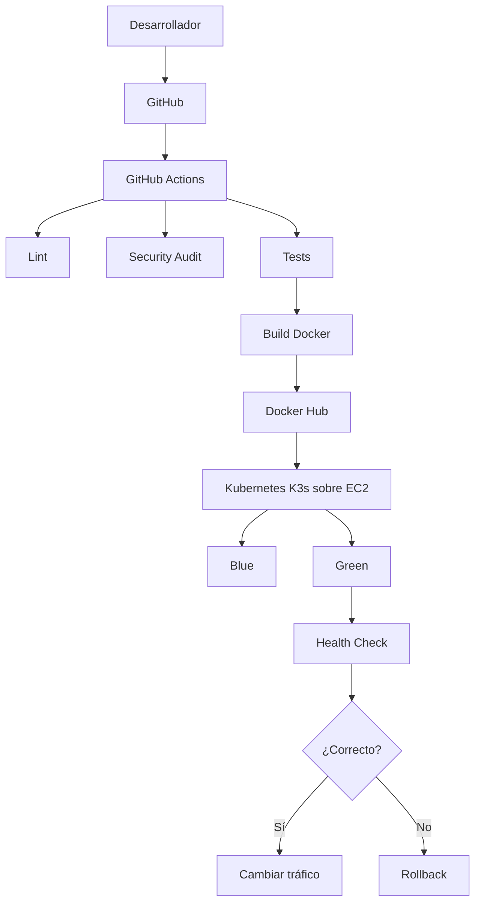
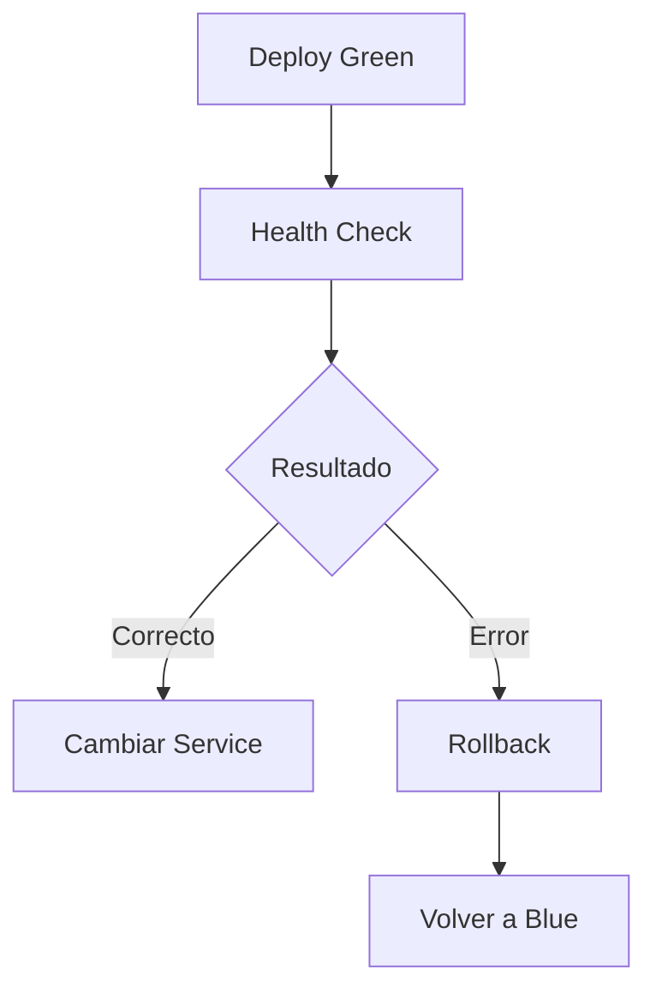

# Evaluación Final Transversal - AUY1104

# Operación Resiliencia en TechMarket

## Tabla de Contenidos

- Descripción
- Objetivos
- Arquitectura de la Solución
- Estructura del Proyecto
- Función de los Archivos Principales
- Herramientas Utilizadas
- Plantillas Reutilizables
- Pipeline CI
- Variables de Entorno Dinámicas
- Pipeline CD
- Estrategia de Despliegue
- Comparación entre Estrategias
- Justificación de Blue-Green
- Mecanismo de Remediación Automática
- Escenarios de Error
- Beneficios para el Negocio
- Conclusión
- Referencias
- Integrante

---

# Descripción

Este repositorio corresponde a la Evaluación Final Transversal (EFT) de la asignatura **Ciclo de Vida del Software II (AUY1104)**.

El proyecto implementa un proceso completo de Integración Continua (CI) y Despliegue Continuo (CD) utilizando GitHub Actions, Docker Hub y Kubernetes, incorporando una estrategia **Blue-Green Deployment** junto con mecanismos de recuperación automática (Rollback) para garantizar la continuidad operacional del servicio.

> Para esta evaluación se utiliza la infraestructura desarrollada durante el semestre. De acuerdo con la indicación del docente, el rol de Amazon EKS fue implementado utilizando **K3s sobre una instancia EC2**, mientras que el rol de Amazon ECR fue reemplazado por **Docker Hub**, manteniendo la misma lógica de automatización y despliegue.

---

# Objetivos

## Objetivo General

Implementar un pipeline CI/CD reutilizable que automatice la construcción, validación y despliegue del microservicio utilizando GitHub Actions y Kubernetes.

## Objetivos Específicos

- Automatizar la construcción de imágenes Docker.
- Publicar automáticamente imágenes en Docker Hub.
- Reutilizar workflows mediante GitHub Actions.
- Implementar una estrategia Blue-Green.
- Automatizar la recuperación mediante Rollback.
- Reducir el riesgo de indisponibilidad durante los despliegues.

---

# Arquitectura de la Solución



---

# Estructura del Proyecto

```text
SharedClient/
├── .github/workflows
├── k8s
├── Dockerfile
└── package.json

SharedWorkflows/
└── .github/workflows
```

---

# Función de los Archivos Principales

| Archivo | Función |
|----------|---------|
| client.yaml | Ejecuta el pipeline principal |
| deploy-api.yaml | Build y Push Docker Hub |
| deploy-k8s-api.yaml | Despliegue Kubernetes |
| cd-pipeline.yaml | Blue-Green y Rollback |
| hotfix.yml | Hotfix Deployment |
| test.yml | Lint, Audit y Tests |
| blue-green.yaml | Estrategia Blue-Green |
| canary.yaml | Estrategia Canary |
| rolling-update.yaml | Rolling Update |

---

# Herramientas Utilizadas

| Herramienta | Función |
|-------------|----------|
| Git | Control de versiones |
| GitHub | Repositorio |
| GitHub Actions | CI/CD |
| Docker | Contenedores |
| Docker Hub | Registro de imágenes |
| Kubernetes (K3s) | Orquestación |
| Node.js | Aplicación |

---

# Plantillas Reutilizables

Con el propósito de cumplir el **Ítem 1** de la Evaluación Final Transversal, el pipeline fue refactorizado para utilizar **GitHub Actions** mediante **workflows reutilizables** (`workflow_call`).

Esta estrategia permite desacoplar la lógica del pipeline, evitando duplicación de código y facilitando su reutilización.

Las principales plantillas implementadas son:

- **deploy-api.yaml:** construcción de la imagen Docker y publicación automática en Docker Hub.
- **deploy-k8s-api.yaml:** despliegue de manifiestos Kubernetes.
- **client.yaml:** invoca el workflow reutilizable utilizando `uses`.
- **cd-pipeline.yaml:** implementa Blue-Green Deployment, validación de salud y rollback automático.

La reutilización se logra mediante **inputs**, **secrets** y **variables de entorno**, permitiendo utilizar la misma plantilla en distintos proyectos sin modificar el código fuente.

---

# Pipeline CI

El proceso de Integración Continua fue completamente migrado a **GitHub Actions**.

El pipeline ejecuta automáticamente:

1. Checkout del repositorio.
2. Instalación de dependencias.
3. ESLint.
4. Auditoría de seguridad (`npm audit`).
5. Ejecución de pruebas automáticas.
6. Construcción de la imagen Docker.
7. Publicación automática de la imagen en Docker Hub.

La construcción y publicación se realiza mediante un **workflow reutilizable**, cumpliendo con el proceso solicitado para la automatización del Build.

---

# Variables de Entorno Dinámicas

Con el objetivo de reutilizar los pipelines sin modificar el código fuente, la solución utiliza variables dinámicas e información sensible almacenada como **GitHub Secrets**.

Entre ellas destacan:

- image-name
- image-tag
- DOCKER_USERNAME
- DOCKER_PASSWORD
- AWS_ACCESS_KEY_ID
- AWS_SECRET_ACCESS_KEY
- AWS_SESSION_TOKEN

Gracias a esta parametrización, el mismo workflow puede desplegar distintas versiones del microservicio sin realizar cambios en los archivos YAML.

---

# Pipeline CD

El pipeline de Despliegue Continuo ejecuta automáticamente:

1. Checkout.
2. Configuración de Kubernetes.
3. Despliegue Blue-Green.
4. Validación de Salud.
5. Cambio automático de tráfico.
6. Rollback automático en caso de falla.

---

# Estrategia de Despliegue

Se seleccionó **Blue-Green Deployment** debido a que permite mantener dos versiones del servicio ejecutándose simultáneamente.

La nueva versión (**Green**) es validada antes de recibir tráfico.

Una vez superadas las validaciones, el Service cambia automáticamente el tráfico hacia Green.

Si alguna validación falla, el Service permanece apuntando a Blue.

---

# Comparación entre Estrategias

| Estrategia | Disponibilidad | Riesgo | Rollback |
|------------|---------------|---------|-----------|
| All-in-Once | Baja | Alto | Difícil |
| Rolling Update | Media | Medio | Medio |
| Canary | Alta | Bajo | Muy rápido |
| Blue-Green | Muy alta | Muy bajo | Inmediato |

---

# Justificación de Blue-Green

Blue-Green fue seleccionada por ofrecer:

- Alta disponibilidad.
- Cambio de tráfico prácticamente inmediato.
- Validación antes de publicar la nueva versión.
- Recuperación automática mediante rollback.
- Menor riesgo para un servicio crítico como TechMarket Orders.

---

# Mecanismo de Remediación Automática



El pipeline incorpora lógica condicional (`if: failure()`) que ejecuta automáticamente el proceso de rollback cuando la validación de salud falla.

---

# Escenarios de Error

Durante el desarrollo fueron considerados escenarios reales de Kubernetes como:

- CrashLoopBackOff.
- ImagePullBackOff.
- Readiness Probe fallida.
- Liveness Probe fallida.
- Error HTTP 500.
- Imagen inexistente.
- Error de configuración del Deployment.

---

# Beneficios para el Negocio

La arquitectura propuesta permite:

- Reducir tiempos de despliegue.
- Disminuir errores manuales.
- Aumentar la disponibilidad del servicio.
- Reducir el MTTR mediante rollback automático.
- Mejorar la continuidad operacional del sistema TechMarket Orders.

---

# Conclusión

La solución implementa una arquitectura DevOps moderna basada en GitHub Actions, Docker Hub y Kubernetes, incorporando workflows reutilizables, despliegue Blue-Green y rollback automático para reducir riesgos durante la liberación de nuevas versiones y mejorar la continuidad operacional.

---

# Referencias

- GitHub Actions Documentation
- Docker Documentation
- Docker Hub Documentation
- Kubernetes Documentation
- Node.js Documentation

---

# Integrante

**Valentina Paz Astudillo Martinez**

---

**Asignatura:** Ciclo de Vida del Software II (AUY1104)

**Evaluación:** Evaluación Final Transversal (EFT)

**Institución:** Duoc UC - Sede Antonio Varas